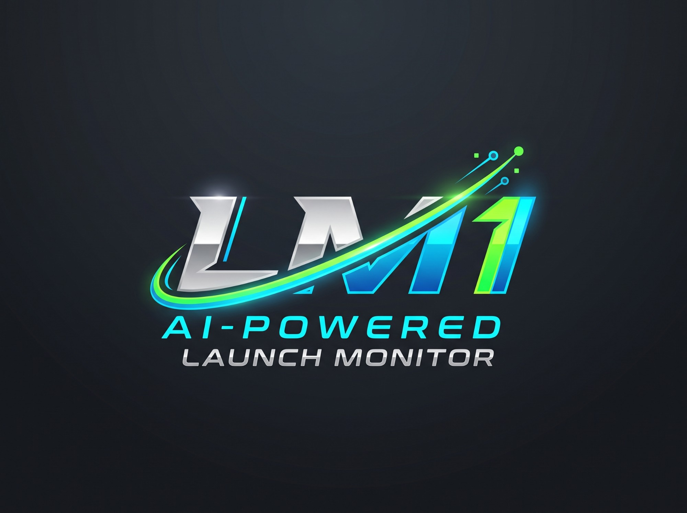

<p align="center">
  
</p>

<h1 align="center">LM1 — DIY Camera Golf Launch Monitor</h1>

<p align="center">
  A Raspberry Pi 5 + OV9281 global-shutter camera launch monitor, with a React Native companion app that talks to it over Bluetooth LE.
</p>

<p align="center">
  
  
  
  
  
</p>

---

> [!WARNING]
> **LM1 is an experimental hobby project.** Its measurements are unvalidated estimates and have not been checked against a reference launch monitor. Every value is labelled as measured, camera-estimated or club-estimated, with a confidence score. Treat the numbers as indicative only.

## What it is

LM1 has three parts:

| Part | Where | What it does |
| --- | --- | --- |
| **Mobile app** | [`App.tsx`](App.tsx), [`src/`](src) | Expo / React Native app for iOS and Android. It arms the monitor, shows shots, sessions and putting, and handles calibration and device setup. |
| **Pi service** | [`raspberry_pi/`](raspberry_pi) | A Python BLE peripheral on a Raspberry Pi 5. It keeps a rolling high-speed capture buffer, detects shots and runs the computer vision. |
| **Hardware** | [`hardware/`](hardware) | Parametric CAD scripts and printable STLs for the enclosure, camera brackets, IR light mounts and cable clips. |

```text
OV9281 camera ──► Raspberry Pi 5 ──BLE──► LM1 app ──► OpenGolfSim / n8n webhook
                  │                                  
                  ├─ rolling RAM buffer              
                  ├─ ball + AprilTag detection       
                  ├─ trajectory fit                  
                  └─ club silhouette / tag tracking  
```

The phone and the Pi talk **only over Bluetooth LE**. You don't need a shared network, an IP address or port forwarding. The Pi's Wi-Fi is left free for updates, SSH and simulator traffic.

## Features

**Measurement (Pi)**
- Ball speed, launch angle and start direction from a sub-pixel trajectory fit over up to 48 tracked frames
- Clubhead speed, attack angle and club path, from a club AprilTag or from the clubhead silhouette when no tag is fitted
- Smash factor, strike location on the face and surface spin estimates
- Putting motion analysis: pace, start line, skid and roll
- AprilTag ground calibration saved as a 3D pose, so the tag can be removed after calibration
- Lens calibration, a saved target line, and automatic exposure (shutter + gain)
- The last 100 rolling captures are kept on the Pi, each with a contact sheet for review

**App**
- Live monitor with ready → armed → processing → result states
- Club selection, carry estimates, shot history, session averages and consistency
- Shot review shows each metric's source and confidence
- Dedicated putting monitor and a manual shot calculator
- Device screen covering Wi-Fi setup over BLE, camera tuning, calibration and health diagnostics
- Metric or imperial units, set once and used on every screen
- [OpenGolfSim](OPENGOLFSIM.md) Desktop and Web forwarding, plus n8n webhook export
- Interactive demo mode, so you can try the app without any hardware

## Hardware

| Component | Notes |
| --- | --- |
| Raspberry Pi 5 | 1 GB is enough; use active cooling |
| OV9281 global-shutter camera | CSI, high frame rate (90–200+ fps depending on mode) |
| Continuous LED / IR lighting | Needed for the short exposure times |
| AprilTag target | For ground-plane calibration (see [`scripts/create_apriltag_target.py`](scripts/create_apriltag_target.py)) |
| 3D-printed parts | See [`hardware/enclosure/README.md`](hardware/enclosure/README.md) |

The full design rationale is in [`golf_launch_monitor_project.md`](golf_launch_monitor_project.md).

## Getting started

### 1. Run the app

You need Node.js 20+ and an LM1 **development build** installed on a phone. BLE uses native code, so the app **does not run in Expo Go**.

```bash
npm install
npm start
```

Then open the dev server from the LM1 development app on your phone. To build one:

```bash
npm run build:android:dev
```

```bash
npm run build:ios:dev
```

Android can also be built locally with `npm run android`. iOS builds go through EAS and need an Apple Developer account, but no Mac.

**No hardware?** Open the **Device** tab and choose **Use interactive demo**.

### 2. Set up the Raspberry Pi

Follow [`raspberry_pi/README.md`](raspberry_pi/README.md): flash Raspberry Pi OS Lite (64-bit), copy the `raspberry_pi/` folder over and run `install.sh`. This installs the BLE service as a systemd unit. The app finds the Pi by its BLE service UUID, so there is nothing to configure.

### 3. Calibrate

In the app, work through the checklist on the home screen:

1. **Lens calibration**, done once per lens and focus setting
2. **AprilTag ground calibration**, done with the tag in view; you can remove the tag afterwards
3. **Automatic exposure**, then fine-tune shutter and gain by hand if needed

[`LAUNCH_MEASUREMENTS.md`](LAUNCH_MEASUREMENTS.md) covers the full setup.

## Scripts

| Command | Purpose |
| --- | --- |
| `npm start` | Start the Expo dev server for the dev client |
| `npm run android` / `npm run ios` | Build and run on a connected device |
| `npm run web` | Web preview (demo only, no BLE) |
| `npm run typecheck` | TypeScript check |
| `npm run lint` | ESLint |
| `npm run ogs:bridge` | Start the OpenGolfSim Desktop WebSocket→TCP bridge |
| `npm run test:ogs` | Test the OpenGolfSim bridge |
| `npm run test:capture` | Test the capture client |

The Pi tests live in [`raspberry_pi/tests/`](raspberry_pi/tests). Run them on the Pi with:

```bash
python -m unittest discover -s raspberry_pi/tests -q
```

## Project layout

```text
App.tsx                  App shell and tab navigation
src/
  components/            UI and shot visualizations
  context/               Device/demo state and reconnection
  screens/               Home, Putting, Calculator, History, Calibration, Device
  services/              BLE client, OpenGolfSim and n8n integrations
  theme.ts, types.ts     Design tokens and shared types
raspberry_pi/            Pi BLE service, vision pipeline, calibration, tests, systemd
bridge/                  OpenGolfSim Desktop bridge
scripts/                 Calibration targets, capture audit and replay tools
hardware/                Enclosure, bracket and clip CAD (Python) + STLs
shared-hosting-server/   Optional PHP/MySQL API for uploading shot data and images
camera-tests/            Reference frames from camera bring-up
```

## Documentation

| Doc | Contents |
| --- | --- |
| [`DEVICE_API.md`](DEVICE_API.md) | BLE protocol spec (commands, events, chunking) |
| [`LAUNCH_MEASUREMENTS.md`](LAUNCH_MEASUREMENTS.md) | How measurements are made and how to calibrate |
| [`OPENGOLFSIM.md`](OPENGOLFSIM.md) | Simulator connection setup |
| [`raspberry_pi/README.md`](raspberry_pi/README.md) | Pi installation and service details |
| [`hardware/enclosure/README.md`](hardware/enclosure/README.md) | Enclosure revisions and print notes |
| [`shared-hosting-server/README.md`](shared-hosting-server/README.md) | Optional upload API |
| [`CHANGELOG.md`](CHANGELOG.md) | Release history |

## Security note

In this MVP, BLE pairing and Wi-Fi provisioning work for anyone in Bluetooth range. Before using LM1 in a shared space, turn off provisioning or add authenticated bonding.

## Contributing

This is a personal project, but issues and pull requests are welcome. Before opening a PR, run `npm run typecheck` and `npm run lint`, and run the Pi test suite if you changed the Pi service.
